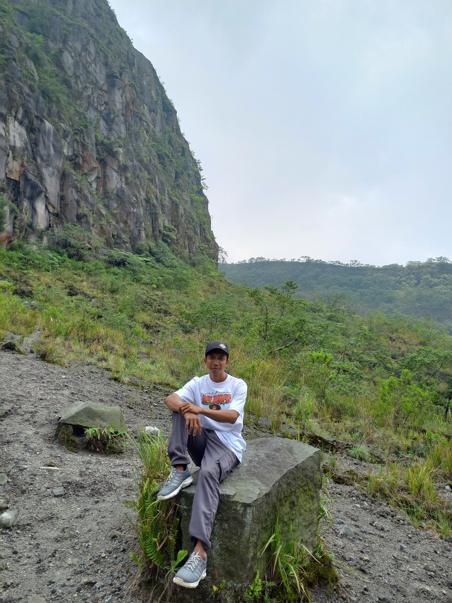
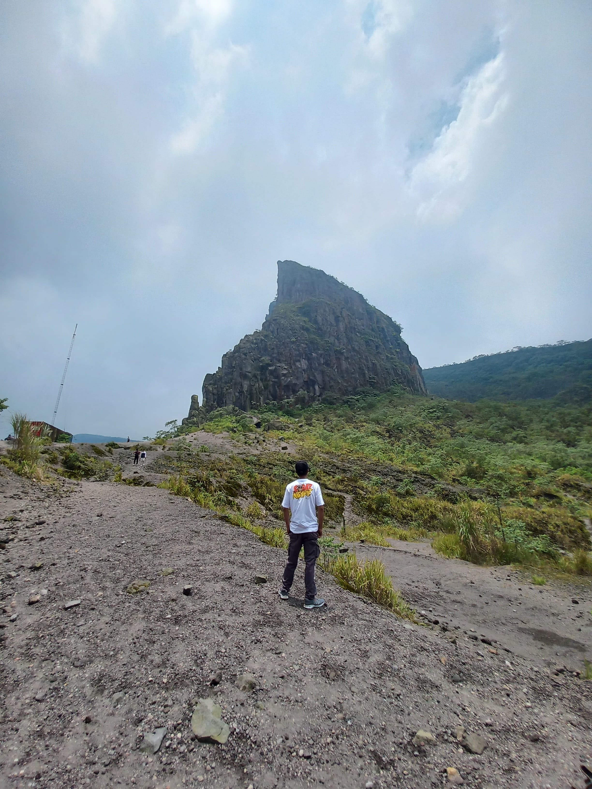
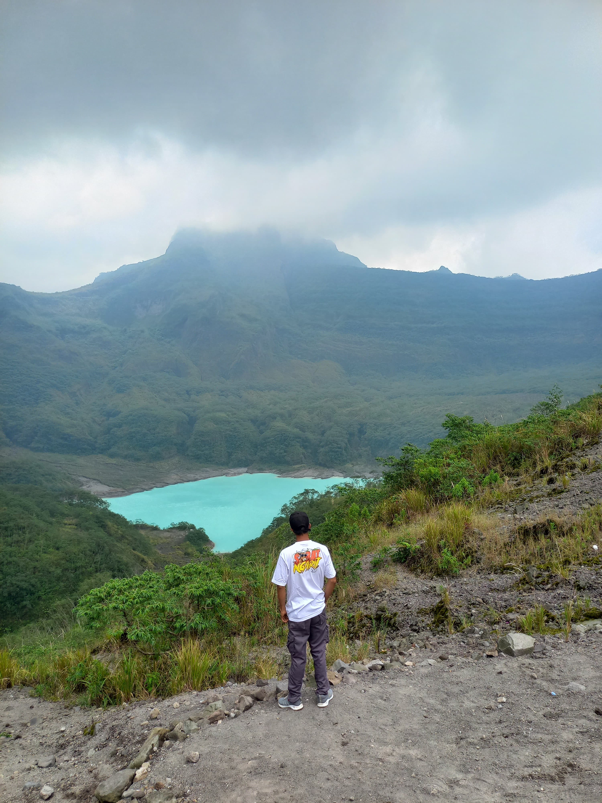
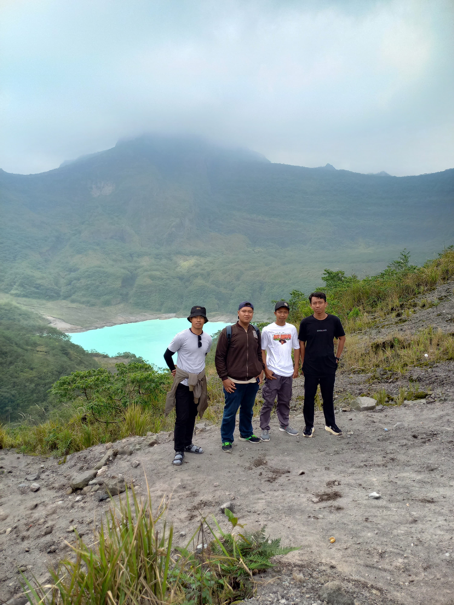

Rencana ke Wisata Gunung Kelud memang sudah lama sama seperti rencana ke Gunung Bromo waktu itu, akan tetapi sudah terlaksana hari ini. Dikediri tidak hanya terkenal dengan simpang gumulnya ada wisata yang tak kalah indah yaitu Wisata Gunung Kelud, dimana kalian bisa menanjak dengan menaiki ojek dimana bisa langsung ke Kawahnya. Ya walaupun via blitar juga ada pendakian Gunung Kelud langsung ke puncak sejatinya.
 
Emang dari dulu pingin ke kelud sebelum ke bromo karena pemandangannya yang bagus dan medannya pun juga tidaklah sulit menggunakan sepeda motor. 

## Berangkat ke Lamongan
Dari lamongan mempir dulu ke rumah temen untuk diajak kesana, karena masih pertama tentu tidak mungkin lah sendiri kesana karena belum mengetahui jalan nya juga. Karena Lamongan - Kediri itu dua jam jadi harus berangkat pagi banget. Berangkat sekitar jam 06.30 dari Lamongan dimana kalian tau kalau cuaca nya saat siang panas banget jadi agar tidak sakit disiasati berangkat pagi. 

 
Sampai disana atau tepat dikawasan Gunung Kelud itu sekitar jam sembilan yang mana karena masih mencari jalan nya jadi masih nyata tidak terlalu buru - buru. Suasana dilereng kelud sejuk tidaklah panas seperti yang dibayangkan, walaupun memakai jaket pun suhunya sangatlah dingin banget.

Untuk jalur kesana saya lewat jombang ke pare yang mana lebih aman dan jalan pun enak tanpa ada kendala, untuk yang dari lamongan mau kekelud lebih baik lewat situ aja karena lebih aman dan mudah lah diingat

## Harga Tiket Masuk Gunung Kelud
Karena kesana hari minggu jadi harga tiket Gunung Kelud itu sekitar 10 ribu perorang ditambah parkir 3 ribu untuk sepeda jadi total semua menjadi 23 ribu karena kali ini berdua sama teman saya, itu menurut kalian malah apa murah? Kalau menurut pribadi murah banget itu.

Sedangkan untuk ojek sendiri kalian bisa membayar Pulang pergi sekitar 40 ribu atau mau saat pulang saja juga bisa harganya pun tetap sama.

Tapi kalian bisa juga jalan kaki apabila menggunakan ojek tersebut sangatlah mahal, karena uang segitu lumayanlah untuk membuat makan atau membeli es disana. 

 
Akan tetapi saya lebih memilih untuk jalan kaki karena jalan nya pun sudah aspalan dan memakai cor jadi tidaklah sulit, saya dapat teman baru yang dari surabaya yang mana ingin ke gunung kelud juga. 

 

Dari batas akhir parkiran memilih jalan kaki bersama Bahrul dan satu lagi teman nya lupa namanya siapa, jika jalan kaki tidaklah sampai satu jam, karena tujuannya berwisata dan mencari ketenangan jadi memilih jalan santai saja. 

Dipuncak pun sebelum ke bawah turun bertemu mas rio asli orang kediri yang mana jika dihitung semua menjadi 10 orang jadi saat turun kebawah jadi sangatlah ramai. Karena banyak mereka lupa sampai namanya tanya yang penting salah satu dari mereka sudah kenal. 
 
Gunung Kelud: Keindahan dan Keperkasaan Gunung Api di Jawa Timur
### 1. Sekilas Tentang Gunung Kelud
Gunung Kelud adalah salah satu gunung berapi aktif yang terletak di perbatasan antara tiga kabupaten di Jawa Timur, yaitu Kediri, Blitar, dan Malang . Gunung ini memiliki ketinggian sekitar 1.731 meter di atas permukaan laut dan terkenal karena keindahan alamnya yang menakjubkan serta sejarah letusannya yang dahsyat.

Nama “Kelud” berasal dari bahasa Jawa Kuno yang berarti "bahaya" atau "kemarahan alam" , menggambarkan betapa kuatnya aktivitas vulkanik gunung ini sejak zaman dahulu.

### 2. Sejarah Letusan Gunung Kelud
Gunung Kelud telah tercatat meletus lebih dari 30 kali sejak abad ke-15. Beberapa letusan besar bahkan menimbulkan dampak luas hingga ke berbagai daerah di Pulau Jawa.

Beberapa letusan besar antara lain:

- Letusan tahun 1586 – turun sekitar 10.000 jiwa.
- Letusan tahun 1919 – menghasilkan lahar besar yang menghancurkan ribuan rumah.
- Letusan tahun 1990 dan 2014 – menyebarkan abu vulkanik hingga Yogyakarta bahkan ke Jawa Barat.
- Letusan terakhir terjadi pada 13 Februari 2014 , yang menyebabkan abu tebal menutupi langit di sebagian besar Pulau Jawa. Setelah letusan itu, terbentuklah kawah baru dengan danau kecil di tengahnya , yang kini menjadi daya tarik wisata utama.

### 3.Keindahan Alam Gunung Kelud
Gunung Kelud memiliki panorama alam yang menakjubkan. Dari puncaknya, pengunjung dapat menikmati pemandangan gunung-gunung lain seperti Gunung Wilis, Arjuna, dan Kawi .

Beberapa daya tarik wisata di Gunung Kelud antara lain :

- Kawah Kelud – Kawah dengan air berwarna hijau kebiruan yang menawan.
- Terowongan Ampera – Terowongan peninggalan kolonial Belanda yang dibangun untuk mengalirkan air kawah.
- Jalur Pendakian dan Off-road – Cocok bagi pencinta alam dan petualangan.
- Pemandian Air Panas – Air alami yang dipercaya bermanfaat bagi kesehatan kulit.

### 4. Akses dan Lokasi Gunung Kelud
Gunung Kelud dapat diakses dengan mudah dari pusat Kota Kediri , sekitar 35 km ke arah timur. Jalur menuju puncak sudah tertata dengan baik, dan pengunjung bisa menggunakan kendaraan hingga ke area parkir sebelum kawah.

Dari situ, wisatawan dapat melanjutkan dengan berjalan kaki atau menggunakan jasa ojek gunung menuju puncak kawah.

### 5. Fakta Unik Gunung Kelud
- Gunung ini memiliki danau kawah yang suhunya dapat berubah setelah aktivitas vulkanik.
- Gunung Kelud termasuk gunung berapi tipe stratovolcano , yang artinya terbentuk dari lapisan lava dan abu.
- Setelah letusan tahun 2014, bentuk puncaknya berubah total dan muncul kubus lava di tengah kawah.
- Gunung Kelud juga menjadi lokasi favorit untuk berburu foto matahari terbit dan bima sakti .

### 6. Tips Berkunjung ke Gunung Kelud
- Gunakan jaket tebal karena suhu di puncak cukup dingin, terutama pagi dan malam hari.
- Datanglah saat musim kemarau (Mei–September) untuk cuaca yang cerah.
- Bawalah air minum dan makanan ringan karena tidak banyak warung di area atas.
- Hormati alam – jangan membuang sampah sembarangan dan ikuti aturan petugas.
